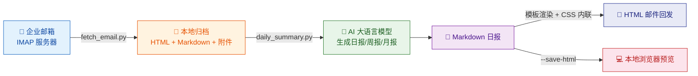
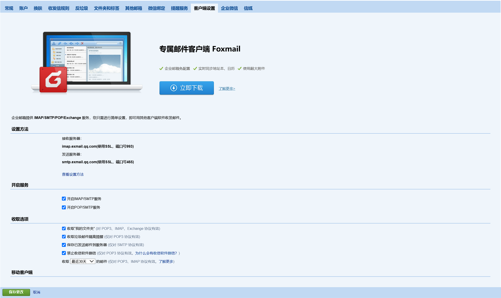
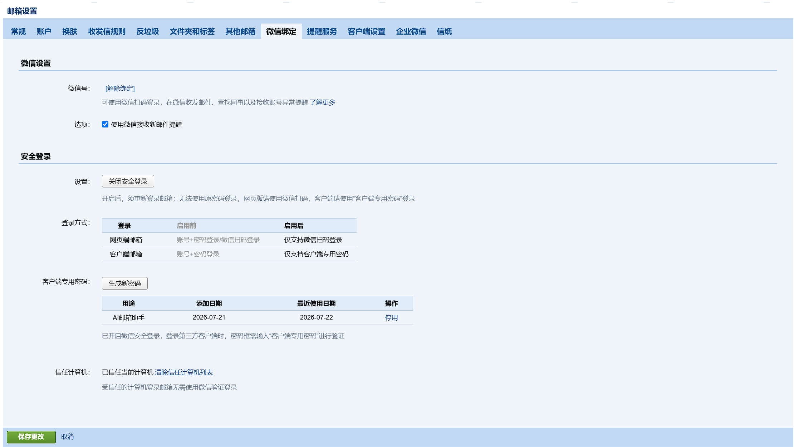

# Email Agent — AI 驱动的邮件日报助手

基于 IMAP 自动拉取邮件归档，结合 OpenAI 兼容 API（DeepSeek / Groq / Ollama 等）生成智能日报/周报/月报，支持 HTML 邮件回发与本地预览。



## 项目背景

中国大多数高校采用企业邮箱（如腾讯企业邮、网易企业邮等）为师生提供邮件服务，但实际使用中存在诸多痛点：

- **邮件管理困难：** 每天收到大量通知、公告、课程邮件、行政通知，手动逐封查阅效率极低，容易遗漏重要的 deadline 或通知。
- **缺乏自动化工具：** 企业微信虽然支持添加邮件机器人，但学校 IT 管理员通常不向普通师生开放此类权限，无法利用官方渠道实现自动化管理。
- **信息过载：** 学期中邮件量激增，学生很难从海量邮件中快速筛选出「今天需要做什么」——哪些是已读即可的通知，哪些是需要立即行动的事项。

**本项目的解决方案**是绕过管理端限制，直接通过 IMAP 协议在客户端拉取邮件、本地归档，再借助 AI 自动生成简洁的日报/周报，帮你一眼看清「今天收到了什么、需要干什么」。

> 本项目首先在 **BNBU（北师香港浸会大学）** 的学生企业邮箱环境下完成测试验证，并在设计上尽可能兼容所有支持 IMAP 协议的邮箱服务商（腾讯企业邮、网易企业邮、阿里企业邮、Google Workspace、Microsoft 365 等）。

## 项目架构

项目采用模块化设计，核心逻辑位于 `email_agent/` 包中，顶层脚本仅负责参数解析与流程编排：

```
email_agent/
├── ai/                        # AI 调用层
│   ├── client.py              # OpenAI 兼容客户端（基于 openai 库）
│   ├── prompts.py             # Prompt 模板集中管理
│   └── date_parser.py         # 日期范围展开工具
├── digest/                    # 日报业务层
│   ├── coordinator.py         # 编排多日汇总（单日 → 聚合两级生成）
│   └── builder.py             # 单日日报构建（读邮件 → 调 AI）
├── templates/
│   └── email_base.html        # 响应式 HTML 邮件模板
├── cli.py                     # 邮件拉取编排（IMAP → 解析 → 归档）
├── config.py                  # 惰性配置加载（支持 OpenAI 兼容参数）
├── imap_client.py             # IMAP 客户端封装
├── local_data.py              # 本地数据路径/状态查询
├── mail_renderer.py           # Markdown → HTML 邮件渲染（模板 + premailer CSS 内联）
├── mail_sender.py             # SMTP 发送（Markdown + HTML 双版本）
├── parser.py                  # 邮件解析（MIME / CID 图片）
├── html_builder.py            # HTML 归档构建
├── md_builder.py              # Markdown 归档构建
└── utils.py                   # 通用工具函数
```

| 模块              | 职责                                                  |
| ----------------- | ----------------------------------------------------- |
| `ai/`           | 封装 AI 调用细节，管理 Prompt 模板，统一错误处理      |
| `digest/`       | 日报生成业务编排：检查本地归档 → 调用 AI → 写入文件 |
| `mail_renderer` | Markdown → 精美 HTML 邮件，含响应式模板与 CSS 内联   |
| `local_data`    | 所有`output/` 路径公式与状态查询的唯一来源          |
| `cli.py`        | 拉取流程编排，自动跳过自己发出的邮件避免反馈循环      |

## 目录

- [项目背景](#项目背景)
- [项目架构](#项目架构)
- [环境准备](#环境准备)
  - [1. Python 环境安装](#1-python-环境安装)
  - [2. 企业邮箱 IMAP 配置（获取客户端专用密码）](#2-企业邮箱-imap-配置获取客户端专用密码)
  - [3. 配置 AI API Key](#3-配置-ai-api-key)
- [快速上手](#快速上手)
  - [第 1 步：配置项目](#第-1-步配置项目)
  - [第 2 步：拉取邮件到本地](#第-2-步拉取邮件到本地)
  - [第 3 步：生成 AI 邮件日报](#第-3-步生成-ai-邮件日报)
  - [第 4 步：邮件回发日报（可选）](#第-4-步邮件回发日报可选)
- [完整命令参考](#完整命令参考)
- [输出目录结构](#输出目录结构)
- [常见问题 FAQ](#常见问题-faq)
- [未来规划](#未来规划)
- [免责声明与使用协议](#免责声明与使用协议)

---

## 环境准备

### 1. Python 环境安装

本工具需要 **Python 3.8 或更高版本**。

**检查是否已安装：**

```bash
python --version
```

如果显示版本号 ≥ 3.8，跳过安装步骤。

**Windows 安装：**

1. 访问 [python.org/downloads](https://www.python.org/downloads/) 下载最新版
2. 运行安装程序，**务必勾选 "Add Python to PATH"**
3. 安装完成后重新打开终端，再次运行 `python --version` 确认

**macOS 安装：**

```bash
# 方式一：官方安装包
# 访问 https://www.python.org/downloads/ 下载 macOS 安装包

# 方式二：Homebrew（推荐）
brew install python@3.12
```

**Linux (Ubuntu/Debian) 安装：**

```bash
sudo apt update
sudo apt install python3
```

**克隆项目并安装依赖：**

```bash
git clone <repository-url>
cd Email_Agent
pip install -r requirements.txt
```

| 依赖          | 用途                                                |
| ------------- | --------------------------------------------------- |
| `openai`    | 调用 OpenAI 兼容 API（DeepSeek / Groq / Ollama 等） |
| `markdown2` | Markdown → HTML 转换（日报邮件回发）               |
| `premailer` | CSS 内联到 HTML 元素（邮件客户端兼容性关键步骤）    |

> Windows 用户还需将 `html-to-markdown/html2markdown.exe` 保持在项目目录中（用于将 HTML 邮件转为 Markdown 归档）。macOS / Linux 用户可安装 [`html2text`](https://pypi.org/project/html2text/) 并修改 `email_agent/md_builder.py` 中的调用方式。

---

### 2. 企业邮箱 IMAP 配置（获取客户端专用密码）

本工具通过 IMAP 协议连接腾讯企业邮箱。需要管理员授权 + 个人生成专用密码两步操作。

> **注意：** 配置 IMAP 使用的**不是你的邮箱登录密码**，而是需要单独生成的 16 位「客户端专用密码」。

#### 第一步：管理员在企微后台授权（如已开启可跳过）

1. 访问 [work.weixin.qq.com](https://work.weixin.qq.com) 并登录管理后台
2. 进入 **协作** → **安全管理** → **客户端访问限制**
3. 找到 **Exchange/IMAP/SMTP 服务范围**，点击修改
4. 勾选需要使用邮件客户端的成员账号
5. 保存设置

#### 第二步：登录网页版邮箱

访问 [exmail.qq.com/login](https://exmail.qq.com/login)，建议使用企业微信扫码登录。

#### 第三步：开启 IMAP/SMTP 服务

1. 点击右上角 **设置** → **客户端设置**
2. 找到 **开启 IMAP/SMTP 服务**，点击勾选
3. 点击 **保存**



#### 第四步：开启安全登录

1. 进入 **设置** → **微信绑定** → **安全登录**
2. 点击 **开启安全登录**，按提示完成验证

#### 第五步：生成客户端专用密码 ⚠️ 最关键

1. 在 **设置** → **邮箱绑定** 页面找到 **客户端专用密码** 区域
2. 点击 **生成新密码**
3. 输入识别名称（如 `Email Agent`）
4. 点击确定，页面会显示一个 **16 位字符的密码**
5. ⛔ **立即复制保存！关闭弹窗后密码无法找回，只能重新生成**



#### 服务器信息（后续配置需要）

| 项目        | 值                                              |
| ----------- | ----------------------------------------------- |
| IMAP 服务器 | `imap.exmail.qq.com`                          |
| IMAP 端口   | `993`                                         |
| IMAP 加密   | SSL                                             |
| SMTP 服务器 | `smtp.exmail.qq.com`                          |
| SMTP 端口   | `465`                                         |
| SMTP 加密   | SSL                                             |
| 密码        | **客户端专用密码**（16 位，非登录密码！） |

---

### 3. 配置 AI API Key

`daily_summary.py` 通过 OpenAI 兼容 API 调用大语言模型生成日报，支持 DeepSeek、OpenAI、Groq、Ollama 等多种服务。

#### 获取 API Key（以 DeepSeek 为例，推荐国内用户使用）

1. 访问 [platform.deepseek.com](https://platform.deepseek.com) 并注册/登录
2. 进入 **API Keys** 页面
3. 创建新的 API Key 并复制

其他服务获取方式：

| 服务商             | 获取地址                                              | 特点                 |
| ------------------ | ----------------------------------------------------- | -------------------- |
| **DeepSeek** | [platform.deepseek.com](https://platform.deepseek.com) | 国内直连，性价比高   |
| **OpenAI**   | [platform.openai.com](https://platform.openai.com)     | 最强模型，需代理     |
| **Groq**     | [console.groq.com](https://console.groq.com)           | 极快推理，有免费额度 |
| **Ollama**   | [ollama.com](https://ollama.com)                       | 本地运行，完全免费   |

#### 配置 API 信息

编辑项目根目录下的 `config.txt`，填入 AI 后端信息：

```ini
# ── AI 后端配置 ──
ai_base_url = https://api.deepseek.com
ai_api_key = sk-your-api-key-here
ai_model = deepseek-v4-flash

# ── AI 生成参数（可选）──
ai_thinking = false           # 深度思考模式（DeepSeek），开启后思考 token 也计费
ai_temperature = 0.3          # 创意度 0.0~2.0，0=严谨 1=发散，日报推荐 0.3
ai_max_tokens = 8192          # 输出最大 token 数，内容多时可调大

# 其他模型示例：
# OpenAI 官方:     base_url=https://api.openai.com/v1  model=gpt-4o-mini
# Groq 极速:       base_url=https://api.groq.com/openai/v1  model=llama-3.3-70b-versatile
# Ollama 本地免费: base_url=http://localhost:11434/v1  model=qwen3:14b  api_key=ollama
```

---

## 快速上手

### 第 1 步：配置项目

```bash
# 复制配置模板
cp config_example.txt config.txt
```

安装 Python 依赖（邮件回发功能需要）：

```bash
pip install -r requirements.txt
```

编辑 `config.txt`，填入你的信息：

```ini
# ── IMAP 接收 ──
imap_server = imap.exmail.qq.com
imap_port   = 993

# ── SMTP 发送（邮件回发功能需要） ──
smtp_server = smtp.exmail.qq.com
smtp_port   = 465

# ── 认证 ──
email = yourname@company.com        # ← 改成你的企业邮箱
password = XXXXXXXXXXXXXXXX         # ← 客户端专用密码（16位）

# ── 日报邮件发送目标（为空则发送给自己） ──
send_to =                            # ← 可选，指定日报接收邮箱

# ── AI 后端配置 ──
ai_base_url = https://api.deepseek.com
ai_api_key = sk-your-key-here       # ← 填入你的 API Key
ai_model = deepseek-v4-flash

# ── AI 生成参数（可选）──
ai_thinking = false                  # 深度思考模式
ai_temperature = 0.3                 # 创意度 0.0~2.0
ai_max_tokens = 8192                 # 输出最大 token 数
```

### 第 2 步：拉取邮件到本地

```bash
# 拉取今天最新 5 封（默认行为）
python fetch_email.py

# 拉取指定日期的邮件
python fetch_email.py --on 2026-07-18

# 拉取日期范围内全部邮件
python fetch_email.py --on 2026-07-01 2026-07-18 --all

# 拉取某天之后的全部邮件
python fetch_email.py --on 2026-07-01 ..

# 拉取限制数量
python fetch_email.py --on 2026-07-01 .. --count 20

# 只看 Markdown 格式
python fetch_email.py --format markdown
```

拉取完成后，邮件归档会保存到 `output/<日期>/html/` 和 `output/<日期>/markdown/` 目录中。

### 第 3 步：生成 AI 邮件日报

```bash
# 今天的日报
python daily_summary.py --today

# 昨天的日报
python daily_summary.py --yesterday

# 指定某天的日报
python daily_summary.py --date 2026-07-18
```

日报内容包含：

- 📊 收件统计表（总数 / 有效 / 撤回 / 附件数 / 时间段）
- 📧 逐封邮件摘要、关键信息与行动项
- 🎯 今日要点总结

**多日汇总：**

```bash
# 本周汇总（周一到今天）
python daily_summary.py --this-week

# 上周汇总
python daily_summary.py --last-week

# 本月汇总
python daily_summary.py --this-month

# 最近 7 天
python daily_summary.py --last 7

# 指定日期范围
python daily_summary.py --range 2026-07-01 2026-07-18
```

多日汇总额外包含：

- 📅 每日重点摘要表
- ✅ 跨天去重合并的待办清单
- 📈 趋势概览（邮件量走势 / 高频主题 / 最活跃发件人）

### 第 4 步：邮件回发日报（可选）

生成日报后，可以通过 SMTP 将日报发送到指定邮箱，支持精美的 HTML 邮件格式：

```bash
# 生成并发送日报
python daily_summary.py --yesterday --send

# 发送到指定收件人
python daily_summary.py --yesterday --send --send-to friend@example.com

# 仅发送已有日报（不重新生成）
python daily_summary.py --last-week --resend

# 重新生成日报 + 发送（仅清 AI 缓存，不动邮件归档）
python daily_summary.py --yesterday --regen --send

# 强制重拉邮件 + 重新生成 + 发送
python daily_summary.py --yesterday --regen --refetch --send

# 渲染 HTML 本地预览（不发送，可在浏览器中直接查看）
python daily_summary.py --yesterday --save-html
```

> **注意：** 邮件回发功能需要在 `config.txt` 中配置 SMTP 服务器信息和客户端专用密码。发送的邮件为 HTML 格式，基于响应式模板渲染，在手机和桌面客户端均可正常显示。不指定 `--send-to` 时，默认发给 `config.txt` 中的 `send_to` 配置项，若未配置则发给自己。

---

## 完整命令参考

### `fetch_email.py` — 邮件拉取归档

| 参数                    | 说明                                                        | 示例                  |
| ----------------------- | ----------------------------------------------------------- | --------------------- |
| `--count N`, `-n N` | 最多拉取 N 封最新邮件，默认 5                               | `--count 10`        |
| `--all`, `-a`       | 获取日期范围内全部邮件（与 --count 互斥）                   | `--all`             |
| `--format`, `-f`    | 输出格式：`html` / `markdown` / `both`，默认 `both` | `--format markdown` |
| `--on`                | 日期过滤（详见下表）                                        | 见下方                |

**`--on` 参数用法：**

| 语法                           | 含义                         |
| ------------------------------ | ---------------------------- |
| `--on now`                   | 今天（默认值）               |
| `--on 2026-07-18`            | 仅 7 月 18 日当天            |
| `--on 2026-07-01 2026-07-18` | 7 月 1 日 至 7 月 18 日      |
| `--on 2026-07-01 ..`         | 7 月 1 日之后（无结束日期）  |
| `--on .. 2026-07-18`         | 7 月 18 日之前（无起始日期） |

---

### `daily_summary.py` — AI 日报生成与发送

**日期参数**（互斥，每次只能使用一个）：

| 参数                  | 说明                  | 示例                              |
| --------------------- | --------------------- | --------------------------------- |
| `--today`           | 今天的邮件日报        |                                   |
| `--yesterday`       | 昨天的邮件日报        |                                   |
| `--date YYYY-MM-DD` | 指定日期的邮件日报    | `--date 2026-07-18`             |
| `--this-week`       | 本周一到今天的汇总    |                                   |
| `--last-week`       | 上周一到上周日的汇总  |                                   |
| `--this-month`      | 本月 1 日到今天的汇总 |                                   |
| `--last N`          | 最近 N 天的汇总       | `--last 7`                      |
| `--range START END` | 指定日期范围的汇总    | `--range 2026-07-01 2026-07-18` |

**发送与刷新参数**（可选，配合日期参数使用）：

| 参数                | 说明                                                                        | 示例                              |
| ------------------- | --------------------------------------------------------------------------- | --------------------------------- |
| `--send`          | 生成后通过 SMTP 发送日报（已有则跳过 AI 直接发送）                          | `--yesterday --send`            |
| `--resend`        | 仅发送已有报告，不重新生成（文件必须存在）                                  | `--last-week --resend`          |
| `--regen`         | 仅清除 AI 日报缓存并重新生成（不动邮件归档，用于 Prompt 调优）              | `--yesterday --regen`           |
| `--refetch`       | 配合`--regen` 使用，同时清除并重新拉取邮件归档                            | `--yesterday --regen --refetch` |
| `--save-html`     | 渲染日报为 HTML 保存到本地（可在浏览器中预览，也可配合`--send` 同时保存） | `--yesterday --save-html`       |
| `--send-to EMAIL` | 指定日报接收邮箱（不指定则用 config 默认值）                                | `--send-to friend@company.com`  |

**组合示例：**

```bash
# 日常使用：生成昨天日报并发送给自己
python daily_summary.py --yesterday --send

# 发送给指定收件人
python daily_summary.py --last-week --send --send-to boss@company.com

# 快速补发：已有报告直接发送
python daily_summary.py --last-week --resend

# 重新生成日报（仅清 AI 缓存，不动邮件）：Prompt 调优后重试
python daily_summary.py --yesterday --regen

# 强制全新：重拉邮件 + 重新生成（不发送）
python daily_summary.py --yesterday --regen --refetch

# 一键全家桶：重拉邮件 + 重新生成 + 发送
python daily_summary.py --yesterday --regen --refetch --send

# 生成日报并保存 HTML 预览
python daily_summary.py --yesterday --save-html

# 生成 + 发送 + 同时保存 HTML 文件
python daily_summary.py --yesterday --send --save-html
```

---

## 输出目录结构

运行后的 `output/` 目录结构如下：

```
output/
├── 2026-07-18/
│   ├── .fetch_complete                            ← 全量拉取完成标记
│   ├── html/
│   │   └── 会议通知_2026_07_18_14_30_00.html      ← HTML 归档
│   ├── markdown/
│   │   └── 会议通知_2026_07_18_14_30_00.md        ← Markdown 归档
│   ├── attachments/
│   │   └── 会议通知_2026_07_18_14_30_00/
│   │       ├── inline_0001.png                     ← 邮件内嵌图片（自动落地）
│   │       └── 季度报告.pdf                         ← 邮件附件
│   ├── 2026-07-18-summary.md                       ← AI 生成的日报
│   └── 2026-07-18-summary.html                     ← HTML 预览（--save-html）
├── 2026-07-01/
│   └── ...
├── 2026-07-01_2026-07-18-summary.md                ← 多日汇总报告
└── 2026-07-01_2026-07-18-summary.html              ← 多日汇总 HTML 预览
```

**目录说明：**

| 目录/文件                   | 内容                                                 |
| --------------------------- | ---------------------------------------------------- |
| `html/`                   | 完整 HTML 邮件归档，可在浏览器直接打开               |
| `markdown/`               | Markdown 格式邮件归档（供 AI 日报读取）              |
| `attachments/`            | 附件和内嵌图片（CID 图片自动落地）                   |
| `YYYY-MM-DD-summary.md`   | AI 生成的单日日报                                    |
| `YYYY-MM-DD-summary.html` | 单日日报的 HTML 渲染版本（使用`--save-html` 生成） |
| `.fetch_complete`         | 标记文件，表示该日期邮件已全量拉取（非部分拉取）     |

---

## 常见问题 FAQ

### Q1: 运行 `fetch_email.py` 提示 `Authentication failed` 登录失败？

- 确认 `config.txt` 中的 `password` 字段填的是**客户端专用密码**（16 位），而非邮箱登录密码
- 确认企业邮箱已开启 IMAP/SMTP 服务（参考 [第二步](#第二步登录网页版邮箱)）
- 确认账号开启了安全登录
- 如果仍失败，重新生成一个新的客户端专用密码再试

### Q2: 运行 `daily_summary.py` 提示 AI API 调用失败？

- 确认 `config.txt` 中 `ai_api_key` 已正确填写
- 确认 `ai_base_url` 地址可访问（如 DeepSeek 的 `https://api.deepseek.com`）
- 检查网络连接是否正常，部分海外服务可能需要代理
- 确认账户有足够余额/额度

### Q3: AI API 调用超时？

- 日报生成涉及 AI 处理多封邮件，默认超时 120 秒
- 检查网络连接是否正常
- 尝试先用少量邮件测试（如 `python fetch_email.py --count 3` 后再生成日报）
- 可尝试切换更快的模型（如 Groq 的 `llama-3.3-70b-versatile`）

### Q4: 日报生成提示 `AIError`？

- 确认 `config.txt` 中 AI 配置项（`ai_base_url`、`ai_api_key`、`ai_model`）已正确填写
- `ai_base_url` 格式为 API 根地址，如 `https://api.deepseek.com`（DeepSeek）或 `https://api.openai.com/v1`（OpenAI）
- 若使用 Ollama 本地模型，确认 Ollama 服务已启动：`ollama serve`，`ai_base_url` 设为 `http://localhost:11434/v1`
- 确认模型名称正确（DeepSeek 为 `deepseek-v4-flash`，OpenAI 为 `gpt-4o-mini` 等）

### Q5: 某天邮件归档缺失（日报提示"以下日期缺少本地邮件归档"）？

- 日报生成依赖本地 `output/<日期>/markdown/` 目录下的 `.md` 文件
- 先用 `fetch_email.py` 拉取对应日期的邮件：
  ```bash
  python fetch_email.py --on 2026-07-18 --all --format markdown
  ```
- 再重新运行日报生成命令

### Q6: 附件或内嵌图片显示异常？

- CID 内嵌图片已自动落地到 `output/<日期>/attachments/` 目录
- HTML/Markdown 归档使用相对路径 `../attachments/...` 引用图片
- 如需在浏览器查看 HTML 归档，确保 `html/` 和 `attachments/` 的相对路径关系未被破坏
- 不要手动移动或重命名 `attachments/` 目录

### Q7: 如何更新已有日报？

日报缓存机制：已生成的 `-summary.md` 会被识别并跳过，避免重复调用 AI。

**方式一：使用 `--regen` 重新生成（推荐）**

```bash
# 仅清除 AI 缓存并重新生成（不动邮件归档，适合 Prompt 调优后重试）
python daily_summary.py --date 2026-07-18 --regen

# 重新生成并发送
python daily_summary.py --yesterday --regen --send
```

**方式二：使用 `--regen --refetch` 完全重建**

当邮件归档本身也需要更新时（如第一次只拉取了部分邮件），加上 `--refetch`：

```bash
# 清除邮件归档 + AI 缓存 → 重新拉取 → 重新生成
python daily_summary.py --yesterday --regen --refetch

# 完全重建并发送
python daily_summary.py --yesterday --regen --refetch --send
```

`--refetch` 需要用户确认 `[y/N]`，避免意外清除邮件归档。

**方式三：手动删除缓存**

直接删除对应的 `-summary.md` 文件，下次运行生成命令时会自动重新生成：

```bash
rm output/2026-07-18/2026-07-18-summary.md
```

### Q8: Windows 终端显示中文乱码？

- 在 PowerShell 中设置编码：`chcp 65001`
- 或设置终端默认编码为 UTF-8（Windows 10 1903+ 支持）：设置 → 时间和语言 → 语言 → 管理语言设置 → 更改系统区域设置 → 勾选 "Beta: 使用 Unicode UTF-8"
- 日文/韩文等非中英文邮件会被 AI 自动识别并翻译为中文摘要

### Q9: `--all` 拉取全部邮件时不想二次确认？

当前设计为安全起见，`--all` 会先统计匹配数并询问确认。暂时无法跳过确认步骤（防止误操作拉取大量邮件）。如需批量拉取，建议先用 `--count N` 分批操作。

### Q10: 邮件回发（`--send`）需要安装什么依赖？

邮件回发需要以下 Python 包：

| 依赖          | 用途                                         |
| ------------- | -------------------------------------------- |
| `openai`    | AI 日报生成（调用 OpenAI 兼容 API）          |
| `markdown2` | Markdown → HTML 转换                        |
| `premailer` | CSS 内联到 HTML 元素（邮件客户端兼容性关键） |

一键安装全部依赖：

```bash
pip install -r requirements.txt
```

如果不使用 `--send` / `--resend` / `--save-html` 功能，可以不安装 `markdown2` 和 `premailer`（但 `openai` 始终需要用于 AI 日报生成）。

### Q11: 邮件发送失败，提示 `SMTP 发送失败`？

- 确认 `config.txt` 中 `smtp_server` 和 `smtp_port` 配置正确（腾讯企业邮箱为 `smtp.exmail.qq.com:465`）
- 确认 `email` 和 `password` 已填写，且密码为**客户端专用密码**（16 位）
- 确认企业邮箱已开启 IMAP/SMTP 服务（参考环境准备第 2 步）
- 某些网络环境可能封锁 SMTP 端口，尝试切换网络后再试

### Q12: `--regen` 与 `--regen --refetch` 有何区别？

`--regen` 仅重新调用 AI 生成日报，不触碰邮件归档：

1. 扫描并清除指定日期范围内的日报缓存（`-summary.md`）
2. 调用 AI 重新生成日报并保存

适合修改 Prompt 后想重新生成日报的场景，速度快且不需要重新连 IMAP。

`--regen --refetch` 则进一步重建邮件归档：

1. 清除日报缓存（同上）
2. 请求用户确认 `[y/N]`
3. 清除指定日期范围内的邮件归档
4. 通过 IMAP 重新拉取邮件
5. 调用 AI 重新生成日报

适合邮件归档本身不完整（如第一次只拉了部分邮件）或需要强制同步的场景。

### Q13: 为什么日报回发后不会再被自己的系统拉取到？

系统在拉取邮件时会自动跳过发件人地址与 `config.txt` 中 `email` 相同的邮件，避免日报回发造成反馈循环（日报 → 发送 → 拉取 → 日报中包含日报 → ...）。

### Q14: `--save-html` 生成的 HTML 和 `--send` 发送的 HTML 有什么区别？

完全相同。`--save-html` 将渲染后的 HTML 保存到 `output/<日期>/<日期>-summary.html`，方便在浏览器中预览效果；`--send` 则将相同的 HTML 通过 SMTP 发送到邮箱。两者可以同时使用：

```bash
python daily_summary.py --yesterday --send --save-html
```

HTML 渲染基于 `email_agent/templates/email_base.html` 响应式模板，通过 `premailer` 将 CSS 内联到 HTML 元素上，确保在 Gmail、Outlook 等主流邮件客户端中正常显示。

### Q15: macOS / Linux 上无法运行 `html2markdown.exe`？

`html-to-markdown/html2markdown.exe` 是 Windows 可执行文件。macOS / Linux 用户可安装 Python 版替代：

```bash
pip install html2text
```

然后修改 `email_agent/md_builder.py` 中的 `html_to_markdown()` 函数，将 subprocess 调用替换为 `html2text` 库调用。

---

## 未来规划

以下方向正在探索中，欢迎通过 Issue 或 PR 参与讨论和贡献：

### 🔔 多渠道通知推送

在 AI 生成日报后，通过多种渠道主动推送提醒，让用户无需手动查看即可获知摘要：

- ~~**邮件回发：** 将日报以邮件形式发回给自己，方便在手机上快速浏览~~ ✅ 已实现（`--send` / `--resend` / `--send-to`）
- ~~**美观 HTML 邮件：** 响应式模板 + premailer CSS 内联，兼容 Gmail/Outlook~~ ✅ 已实现
- **企业微信 / 微信通知：** 通过 Webhook 或 Bot 将日报摘要推送到个人微信或企业微信群
- **桌面通知：** 支持 Windows / macOS 系统级弹窗提醒当日待办事项

### 📊 邮件数据可视化

对长期归档的邮件数据进行统计分析与可视化展示：

- 发件人活跃度排行、邮件量按天/周的走势图
- 关键词云图，快速识别近期高频讨论主题
- 邮件回复延迟统计，识别哪些发件人需要优先关注

### 🏷️ 智能分类与优先级标注

基于 AI 对邮件自动打标签和优先级排序：

- 自动识别「紧急」「重要」「通知」「广告」「社交」等类别
- 支持用户自定义分类规则（如特定发件人、关键词自动归入某类）
- 在日报中对高优先级邮件标红或置顶展示

### 🗄️ 多账号管理与统一日报

支持同时管理多个邮箱账号，生成跨账号的统一日报：

- 同时拉取学生邮箱、个人邮箱、工作邮箱的邮件
- 统一日报中按账号分组展示，一键掌握所有邮箱动态
- 不同账号独立配置，互不干扰

### 📦 一键打包与跨设备同步

让归档数据更易于备份和跨设备查看：

- 将某天的邮件归档打包为独立 HTML 文件（单文件可离线浏览）
- 支持将 `output/` 目录自动同步到云存储（如 OneDrive、坚果云）
- 在多台设备间共享同一套归档，避免重复拉取

### 🌐 Web UI 交互界面

从命令行工具演进为更直观的 Web 应用：

- 基于浏览器查看邮件归档和日报，支持搜索和筛选
- 可视化配置页面，降低新手使用门槛
- 在网页上直接调整 AI 日报生成参数（模型、温度、自定义 prompt）

---

## 免责声明与使用协议

> **在使用本工具前，请仔细阅读以下条款。使用本工具即表示你已阅读并同意本声明的全部内容。**

### 1. 数据安全与隐私

- 本工具通过 IMAP 协议连接你的企业邮箱，**邮件内容和附件将被下载到运行本工具的本地设备**，存储在 `output/` 目录下。
- 你应当确保运行本工具的设备受到妥善保护（如设置强密码、启用磁盘加密、及时安装系统安全补丁），防止邮件数据因设备丢失或未授权访问而泄露。
- 本工具不会以任何形式将你的邮件数据上传至第三方服务器（AI 日报生成过程除外，见下文第 3 条）。
- **强烈建议**：在使用本工具前，确认你的企业或组织允许将邮件下载到本地设备，并遵守所在企业的信息安全管理制度。

### 2. 敏感信息处理

- **请在拉取邮件前自行审查邮箱内容**，确保待处理的邮件中不包含以下敏感信息（或已做脱敏处理）：
  - 身份证号、护照号、银行账号等个人身份信息
  - 商业机密、未公开的财务数据、合同细节
  - 系统密码、API 密钥、Token、数据库连接串等凭证类信息
  - 受法律或监管保护的客户数据、医疗信息等
  - 其他你认为不应离开邮箱服务器的机密内容
- 一旦邮件下载到本地，上述敏感信息将脱离企业邮件系统的访问控制保护，**你需自行承担信息泄露的全部风险**。

### 3. AI 日报生成的第三方服务说明

- `daily_summary.py` 生成的日报功能通过 **OpenAI 兼容 API** 调用云端大语言模型（LLM）处理邮件内容。这意味着：
  - 邮件归档文件（`output/<日期>/markdown/` 目录下的 `.md` 文件）将被读取并作为提示词（prompt）发送至 AI 服务端进行处理。
  - AI 服务提供商将按照其自身的隐私政策和数据处理协议处理你的数据。
  - **请在生成日报前再次确认邮件内容不含有你不希望被外部处理的敏感信息。**
- 你对 AI 生成的日报内容负有最终审核责任。AI 可能存在理解偏差、遗漏关键信息或产生幻觉，**生成内容仅供参考，不应作为决策的唯一依据**。

### 4. 责任限制

- 本工具按「现状」提供，不提供任何明示或暗示的担保，包括但不限于适销性、特定用途适用性及不侵权的担保。
- 在任何情况下，本项目的开发者、维护者及贡献者**均不对因使用或无法使用本工具而导致的任何直接、间接、附带、特殊、惩罚性或后果性损害承担责任**，包括但不限于：
  - 邮件数据丢失或损坏
  - 敏感信息泄露
  - AI 生成的日报内容错误导致的决策失误
  - 违反企业信息安全规定导致的纪律处分或法律责任
  - 第三方服务（AI API）的可用性、准确性或服务质量问题
- 使用本工具可能违反你所在企业的信息安全政策或与邮件服务商的使用协议，**你应自行评估合规风险并独立承担责任**。

### 5. 用户义务

使用本工具，你确认将：

- 仅在自己的企业邮箱账号上使用本工具，**不用于未经授权的第三方邮箱访问**。
- 妥善保管 `config.txt` 中的客户端专用密码和 AI API Key，**不将其分享给他人或提交至公共代码仓库**。
- 定期清理 `output/` 目录中不再需要的邮件归档文件，**避免长期堆积导致本地数据泄露风险**。
- 如发现任何安全漏洞或异常行为，及时通过项目 Issue 渠道反馈，**不利用漏洞进行任何恶意活动**。

### 6. 条款变更

本免责声明可能随项目更新而修改。使用本工具即表示你同意受最新版本声明的约束。**建议在每次更新项目后重新阅读本声明**。

---

> *本免责声明最终解释权归项目维护者所有。如有疑问，请在项目中提交 Issue 或在内部群沟通。*
